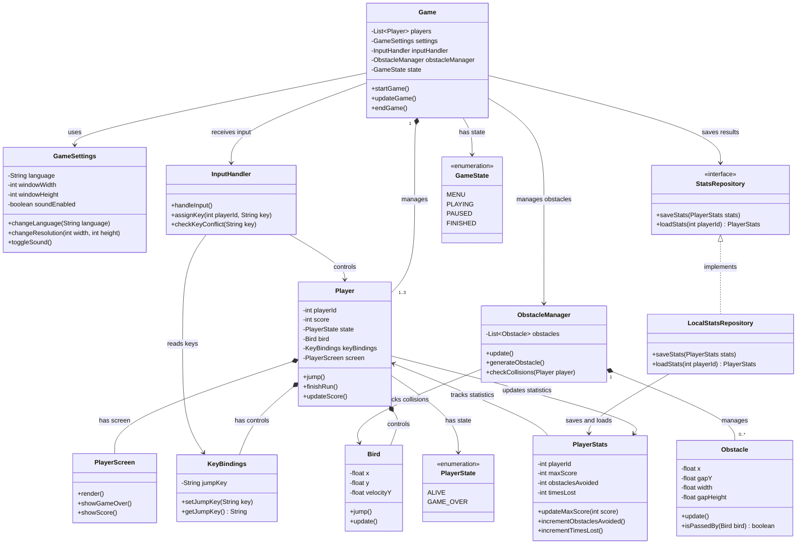

```mermaid
classDiagram

    class Game {
        -List~Player~ players
        -GameSettings settings
        -InputHandler inputHandler
        -ObstacleManager obstacleManager
        -GameState state
        +startGame()
        +updateGame()
        +endGame()
}

    class GameSettings {
        -String language
        -int windowWidth
        -int windowHeight
        -boolean soundEnabled
        +changeLanguage(String language)
        +changeResolution(int width, int height)
        +toggleSound()
    }

    class Player {
        -int playerId
        -int score
        -PlayerState state
        -Bird bird
        -KeyBindings keyBindings
        -PlayerScreen screen
        +jump()
        +finishRun()
        +updateScore()
    }

    class Bird {
        -float x
        -float y
        -float velocityY
        +jump()
        +update()
    }

    class PlayerScreen {
        +render()
        +showGameOver()
        +showScore()
    }

    class InputHandler {
        +handleInput()
        +assignKey(int playerId, String key)
        +checkKeyConflict(String key)
    }

    class KeyBindings {
        -String jumpKey
        +setJumpKey(String key)
        +getJumpKey() String
    }

    class ObstacleManager {
        -List~Obstacle~ obstacles
        +update()
        +generateObstacle()
        +checkCollisions(Player player)
    }

    class Obstacle {
        -float x
        -float gapY
        -float width
        -float gapHeight
        +update()
        +isPassedBy(Bird bird) boolean
    }

    class StatsRepository {
        <<interface>>
        +saveStats(PlayerStats stats)
        +loadStats(int playerId) PlayerStats
    }

    class LocalStatsRepository {
        +saveStats(PlayerStats stats)
        +loadStats(int playerId) PlayerStats
    }

    class PlayerStats {
        -int playerId
        -int maxScore
        -int obstaclesAvoided
        -int timesLost
        +updateMaxScore(int score)
        +incrementObstaclesAvoided()
        +incrementTimesLost()
    }

    class GameState {
        <<enumeration>>
        MENU
        PLAYING
        PAUSED
        FINISHED
    }

    class PlayerState {
        <<enumeration>>
        ALIVE
        GAME_OVER
    }

    Game "1" *-- "1..3" Player : manages
    Game --> GameSettings : uses
    Game --> InputHandler : receives input
    Game --> ObstacleManager : manages obstacles
    Game --> StatsRepository : saves results

    Player *-- Bird : controls
    Player *-- KeyBindings : has controls
    Player *-- PlayerScreen : has screen
    Player --> PlayerStats : updates statistics
    Player --> PlayerState : has state

    InputHandler --> KeyBindings : reads keys
    InputHandler --> Player : controls

    ObstacleManager "1" *-- "0..*" Obstacle : manages
    ObstacleManager --> Bird : checks collisions

    StatsRepository <|.. LocalStatsRepository : implements
    LocalStatsRepository --> PlayerStats : saves and loads
    PlayerStats --> Player : tracks statistics

    Game --> GameState : has state
```