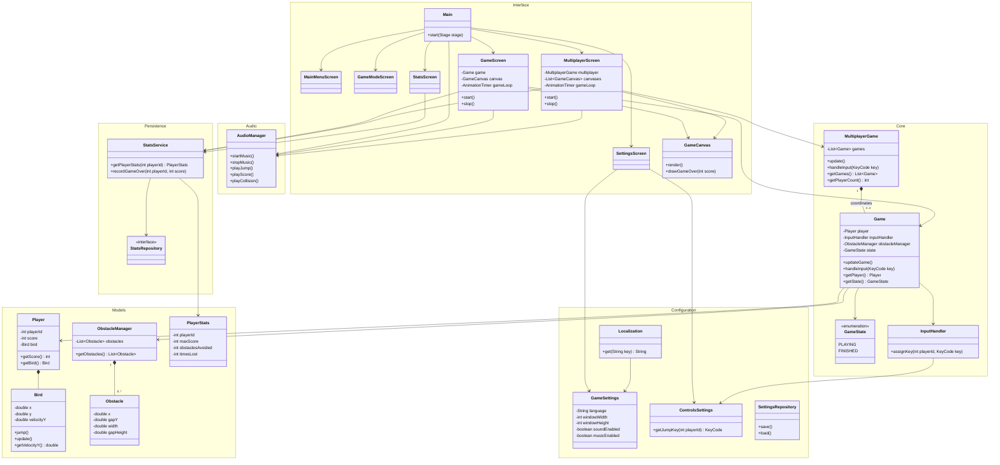

```mermaid

classDiagram
    direction TB

    namespace Core {
        class Game {
            -Player player
            -InputHandler inputHandler
            -ObstacleManager obstacleManager
            -GameState state
            +updateGame()
            +handleInput(KeyCode key)
            +getPlayer() Player
            +getState() GameState
        }

        class MultiplayerGame {
            -List~Game~ games
            +update()
            +handleInput(KeyCode key)
            +getGames() List~Game~
            +getPlayerCount() int
        }

        class GameState {
            <<enumeration>>
            PLAYING
            FINISHED
        }

        class InputHandler {
            +assignKey(int playerId, KeyCode key)
        }
    }

    namespace Models {
        class Player {
            -int playerId
            -int score
            -Bird bird
            +getScore() int
            +getBird() Bird
        }

        class Bird {
            -double x
            -double y
            -double velocityY
            +jump()
            +update()
            +getVelocityY() double
        }

        class ObstacleManager {
            -List~Obstacle~ obstacles
            +getObstacles() List~Obstacle~
        }

        class Obstacle {
            -double x
            -double gapY
            -double width
            -double gapHeight
        }

        class PlayerStats {
            -int playerId
            -int maxScore
            -int obstaclesAvoided
            -int timesLost
        }
    }

    namespace Configuration {
        class GameSettings {
            -String language
            -int windowWidth
            -int windowHeight
            -boolean soundEnabled
            -boolean musicEnabled
        }

        class ControlsSettings {
            +getJumpKey(int playerId) KeyCode
        }

        class Localization {
            +get(String key) String
        }

        class SettingsRepository {
            +save()
            +load()
        }
    }

    namespace Persistence {
        class StatsService {
            +getPlayerStats(int playerId) PlayerStats
            +recordGameOver(int playerId, int score)
        }

        class StatsRepository {
            <<interface>>
        }
    }

    namespace Interface {
        class Main {
            +start(Stage stage)
        }

        class MainMenuScreen
        class GameModeScreen
        class SettingsScreen
        class StatsScreen
        class GameScreen {
            -Game game
            -GameCanvas canvas
            -AnimationTimer gameLoop
            +start()
            +stop()
        }

        class MultiplayerScreen {
            -MultiplayerGame multiplayer
            -List~GameCanvas~ canvases
            -AnimationTimer gameLoop
            +start()
            +stop()
        }

        class GameCanvas {
            +render()
            +drawGameOver(int score)
        }
    }

    namespace Audio {
        class AudioManager {
            +startMusic()
            +stopMusic()
            +playJump()
            +playScore()
            +playCollision()
        }
    }

    Main --> MainMenuScreen
    Main --> GameModeScreen
    Main --> SettingsScreen
    Main --> StatsScreen
    Main --> GameScreen
    Main --> MultiplayerScreen
    Main --> AudioManager

    Game --> Player
    Game --> InputHandler
    Game --> ObstacleManager
    Game --> GameState

    MultiplayerGame "1" *-- "2..4" Game : coordinates

    Player *-- Bird
    ObstacleManager "1" *-- "0..*" Obstacle

    GameScreen --> Game
    GameScreen --> GameCanvas
    GameScreen --> StatsService
    GameScreen --> AudioManager

    MultiplayerScreen --> MultiplayerGame
    MultiplayerScreen --> GameCanvas
    MultiplayerScreen --> StatsService
    MultiplayerScreen --> AudioManager

    StatsScreen --> StatsService
    StatsService --> PlayerStats
    StatsService --> StatsRepository

    SettingsScreen --> GameSettings
    SettingsScreen --> ControlsSettings

    Localization --> GameSettings
    InputHandler --> ControlsSettings

```
